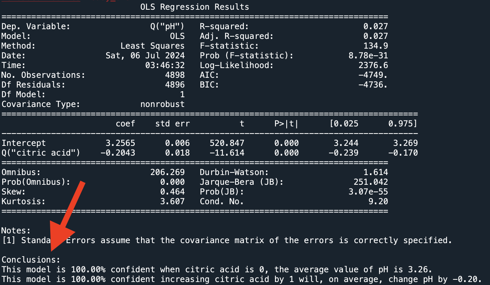
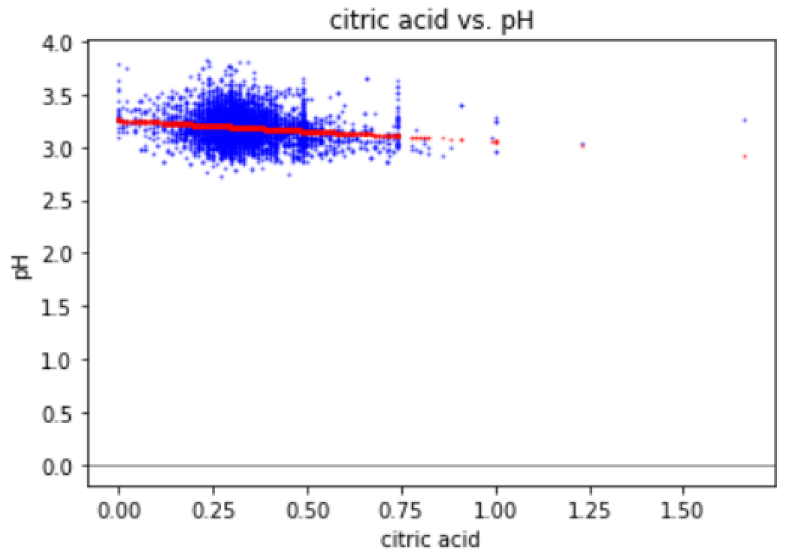

# easy-ols

Generate readable conclusions and graphs for data analysis with ordinary least squares (OLS) regression. Easily see results for different dependent and independent variables. Spend less time setting up the code and more time searching for data insights.





Works with pandas dataframes. You must have pandas, statsmodels, and matplotlib installed.

```py
import pandas as pd

from easy_ols import EasyOLS

data = pd.read_csv("data.csv", sep=";")

myOLS = EasyOLS("pH", "citric acid", data)

myOLS.summary()

myOLS.plot()
```

## How to use

1. Clone this repository
1. Replace the code in usage.py with your own code or move easy_ols.py to your own project in the same directory as your main python file.